# Food Segmentation Pipeline - Project Overview

Hey team! Let me break down what I've built here

## What This Project Does

Basically, I've created an AI system that can look at photos of food and tell you:
- **What food items are in the image** (apple, pizza, sandwich, etc.)
- **How much of each food** (portion sizes)

## The Tech Stack I'm Using

**🎯 YOLO Models** - These are the workhorses for detecting food items. Fast and reliable (5-10 seconds per image)
- YOLOv8, YOLOv9, YOLOv10 variants
- Both detection and segmentation versions
- Different sizes (nano for speed, larger for accuracy)

**🎨 SAM2 (Segment Anything Model 2)** - This gives us food outlines
- Currently slow (that 10+ minute issue we need to fix)
- Can do interactive segmentation (click on food items)

**🔧 Combined Pipeline** - The best of both worlds
- YOLO finds the food quickly
- SAM2 makes the masks super precise
- Nutrition database calculates calories/nutrients

## What I've Built So Far

### 📁 Project Structure
```
├── src/models/           # Core AI models
├── scripts/             # Ready-to-use processing scripts  
├── config/              # Configuration files
├── data/               # Input images, models, results
├── tests/              # Testing framework
└── notebooks/          # Jupyter demos and experiments
```

### 📁 Complete Project Structure
```
<<<<<<< HEAD
[FOLDER] E:\food_segmentation_pipeline
├── .gitattributes
├── .gitignore
├── Executive_Demo_20250611_015010
│   ├── Executive_Demo_Report.html
│   ├── comparison_results
│   ├── detection_results
│   └── original_images
├── README.md
├── Report1.docx
├── Report1.md
├── Report1.pdf
├── Report2.md
├── Report3.md
├── complete_training_run.py
├── config
│   ├── __init__.py
│   ├── config.yaml
│   ├── database_config.yaml
│   ├── dataset_config.yaml
│   ├── metadata_config.yaml
│   ├── models.yaml
│   ├── pipeline_config.yaml
│   ├── training_config.yaml
│   └── training_config.yaml.backup
├── create_achievement_demo.py
├── create_visual_demo.py
├── data
│   ├── databases
│   │   ├── cuisine_mapping
│   │   ├── food_taxonomy
│   │   └── nutrition
│   │       ├── nutrition_expanded.db
│   ├── datasets
│   ├── food_training
│   │   ├── food_dataset.yaml
│   │   ├── images
│   │   │   ├── train
│   │   │   └── val
│   │   └── labels
│   │       ├── train
│   │       └── val
│   ├── input
│   │   ├── TRAINING_IMAGES_GUIDE.md
│   ├── models
│   │   ├── custom_food_detection.pt
│   │   ├── custom_food_detection_working.pt
│   │   ├── metadata_models
│   │   │   └── food101
│   │   │       ├── model.safetensors
│   │   ├── sam2.1_hiera_base_plus.pt
│   │   └── yolo_food_v8.pt
│   ├── output
│   │   ├── achievement_demo
│   │   │   └── batch_testing_20250611_014128
│   │   ├── batch_comparison_report_20250605_143331.html
│   │   ├── batch_comparison_report_20250605_153847.html
│   │   ├── batch_model_comparison
│   │   │   ├── batch_comparison_report_20250605_124545.html
│   │   ├── batch_results_20250605_153847.xlsx
│   │   ├── comparison_report_20250605_152817.html
│   │   ├── comparisons
│   │   ├── confidence_analysis_20250605_151710.csv
│   │   ├── confidence_analysis_20250605_152056.csv
│   │   ├── confidence_analysis_20250605_152212.csv
│   │   ├── confidence_analysis_20250605_152342.csv
│   │   ├── confidence_analysis_20250605_152817.csv
│   │   ├── custom_model_comparison
│   │   │   ├── comparison_report_20250611_012842.html
│   │   │   ├── confidence_analysis_20250611_012842.csv
│   │   │   ├── detailed_detections_20250611_012842.csv
│   │   │   ├── model_comparison_20250611_012842.csv
│   │   │   ├── model_comparison_20250611_012842.xlsx
│   │   │   ├── yolov10n
│   │   │   ├── yolov8m-seg
│   │   │   ├── yolov8n
│   │   │   ├── yolov8n-oiv7
│   │   │   ├── yolov8n-seg
│   │   │   ├── yolov8n-world
│   │   │   ├── yolov8s
│   │   │   ├── yolov8s-seg
│   │   │   ├── yolov9n
│   │   │   └── yolov9s
│   │   ├── custom_tests
│   │   ├── custom_vs_pretrained
│   │   │   ├── batch_comparison_report_20250611_013912.html
│   │   │   ├── batch_results_20250611_013912.xlsx
│   │   │   ├── detailed_results_20250611_013912.csv
│   │   │   ├── model_summary_20250611_013912.csv
│   │   │   └── per_image_comparison_20250611_013912.csv
│   │   ├── detailed_detections_20250605_151710.csv
│   │   ├── detailed_detections_20250605_152056.csv
│   │   ├── detailed_detections_20250605_152212.csv
│   │   ├── detailed_detections_20250605_152342.csv
│   │   ├── detailed_detections_20250605_152817.csv
│   │   ├── detailed_results_20250605_143331.csv
│   │   ├── detailed_results_20250605_153847.csv
│   │   ├── ingredient_counts
│   │   ├── metadata_results
│   │   ├── model_comparison
│   │   │   ├── comparison_report_20250605_124948.html
│   │   │   ├── model_comparison_report_20250605_123408.html
│   │   │   ├── yolov10n
│   │   │   ├── yolov8m-seg
│   │   │   ├── yolov8n
│   │   │   ├── yolov8n-oiv7
│   │   │   ├── yolov8n-seg
│   │   │   ├── yolov8n-world
│   │   │   ├── yolov8s
│   │   │   ├── yolov8s-seg
│   │   │   ├── yolov9n
│   │   │   └── yolov9s
│   │   ├── model_comparison_20250605_151710.csv
│   │   ├── model_comparison_20250605_152056.csv
│   │   ├── model_comparison_20250605_152212.csv
│   │   ├── model_comparison_20250605_152342.csv
│   │   ├── model_comparison_20250605_152817.csv
│   │   ├── model_comparison_20250605_152817.xlsx
│   │   ├── model_summary_20250605_143331.csv
│   │   ├── model_summary_20250605_153847.csv
│   │   ├── per_image_comparison_20250605_143331.csv
│   │   ├── per_image_comparison_20250605_153847.csv
│   │   ├── yolo_results
│   │   │   ├── batch_reports
│   │   │   │   └── dashboard_20250605_093544.html
│   │   │   ├── image1_results_viewer.html
│   │   │   └── visualizations
│   │   ├── yolov10n
│   │   ├── yolov8m-seg
│   │   ├── yolov8n
│   │   ├── yolov8n-oiv7
│   │   ├── yolov8n-seg
│   │   ├── yolov8n-world
│   │   ├── yolov8s
│   │   ├── yolov8s-seg
│   │   ├── yolov9n
│   │   └── yolov9s
│   ├── trained_models
│   │   ├── experiments
│   │   ├── food_detection_20250610_205434
│   │   │   ├── best.pt
│   │   │   └── training_metadata.yaml
│   │   ├── food_detection_20250611_010817
│   │   │   ├── best.pt
│   │   │   └── training_metadata.yaml
│   │   └── food_detection_20250612_144148
│   │       ├── best.pt
│   │       └── training_metadata.yaml
│   └── training
│       ├── annotations
│       ├── food_training
│       │   ├── existing_images_dataset.yaml
│       │   ├── food_dataset.yaml
│       │   ├── food_segmentation_dataset.yaml
│       │   ├── images
│       │   │   ├── train
│       │   │   └── val
│       │   └── labels
│       │       ├── train
│       │       ├── train.cache
│       │       ├── val
│       │       └── val.cache
│       ├── raw_datasets
│       └── splits
├── encoding_utils.py
├── enhanced_batch_tester.py
├── enhanced_single_image_tester.py
├── fast_test.py
├── fix_batch_size_issue.py
├── fix_device_issue.py
├── fix_imports.py
├── fix_segmentation_dataset.py
├── fix_training_issues.py
├── fix_training_issues_windows.py
├── fix_unicode.py
├── food_training_runs
│   ├── food_model_20250607_2019
│   │   ├── args.yaml
│   │   ├── results.csv
│   │   └── weights
│   │       ├── best.pt
│   │       └── last.pt
│   ├── food_model_20250610_2109
│   │   ├── args.yaml
│   │   ├── results.csv
│   │   └── weights
│   │       ├── best.pt
│   │       └── last.pt
│   ├── food_model_20250610_2243
│   │   ├── args.yaml
│   │   ├── results.csv
│   │   └── weights
│   │       ├── best.pt
│   │       └── last.pt
│   ├── food_model_20250610_2346
│   │   ├── args.yaml
│   │   ├── results.csv
│   │   └── weights
│   │       ├── best.pt
│   │       └── last.pt
│   ├── food_model_20250612_1317
│   │   ├── args.yaml
│   │   ├── results.csv
│   │   └── weights
│   │       ├── best.pt
│   │       └── last.pt
│   ├── food_segmentation_20250610_2200_segmentation
│   │   ├── args.yaml
│   │   └── weights
│   ├── food_segmentation_20250610_2204_segmentation
│   │   ├── args.yaml
│   │   └── weights
│   ├── quick_test_0607_2007
│   │   ├── args.yaml
│   │   └── weights
│   ├── quick_test_0610_2029
│   │   ├── args.yaml
│   │   └── weights
│   ├── quick_test_0610_2032
│   │   ├── args.yaml
│   │   └── weights
│   └── quick_test_0610_2046
│       ├── args.yaml
│       ├── results.csv
│       └── weights
│           ├── best.pt
│           └── last.pt
├── get-pip.py
├── hybrid_food_detection.py
├── hybrid_results
├── improved_hybrid_detection.py
├── improved_results
├── logs
│   ├── training_session_20250610_205724
│   ├── training_session_20250610_205858
│   ├── training_session_20250610_210150
│   ├── training_session_20250610_210658
│   ├── training_session_20250610_210702
│   └── training_session_20250610_210714
=======
food_segmentation_pipeline
├── .gitattributes
├── .gitignore
├── README.md
├── config
│   ├── __init__.py
│   ├── config.yaml
│   └── models.yaml
├── data
│   ├── datasets
│   ├── input
│   ├── models
│   │   ├── sam2.1_hiera_base_plus.pt
│   │   └── yolo_food_v8.pt
│   └── output
│       ├── batch_comparison_report_20250605_143331.html
│       ├── batch_comparison_report_20250605_153847.html
│       ├── batch_model_comparison
│       │   ├── batch_comparison_report_20250605_124545.html
│       ├── batch_results_20250605_153847.xlsx
│       ├── comparison_report_20250605_152817.html
│       ├── confidence_analysis_20250605_151710.csv
│       ├── confidence_analysis_20250605_152056.csv
│       ├── confidence_analysis_20250605_152212.csv
│       ├── confidence_analysis_20250605_152342.csv
│       ├── confidence_analysis_20250605_152817.csv
│       ├── detailed_detections_20250605_151710.csv
│       ├── detailed_detections_20250605_152056.csv
│       ├── detailed_detections_20250605_152212.csv
│       ├── detailed_detections_20250605_152342.csv
│       ├── detailed_detections_20250605_152817.csv
│       ├── detailed_results_20250605_143331.csv
│       ├── detailed_results_20250605_153847.csv
│       ├── model_comparison
│       │   ├── comparison_report_20250605_124948.html
│       │   ├── model_comparison_report_20250605_123408.html
│       │   ├── yolov10n
│       │   ├── yolov8m-seg
│       │   ├── yolov8n
│       │   ├── yolov8n-oiv7
│       │   ├── yolov8n-seg
│       │   ├── yolov8n-world
│       │   ├── yolov8s
│       │   ├── yolov8s-seg
│       │   ├── yolov9n
│       │   └── yolov9s
│       ├── model_comparison_20250605_151710.csv
│       ├── model_comparison_20250605_152056.csv
│       ├── model_comparison_20250605_152212.csv
│       ├── model_comparison_20250605_152342.csv
│       ├── model_comparison_20250605_152817.csv
│       ├── model_comparison_20250605_152817.xlsx
│       ├── model_summary_20250605_143331.csv
│       ├── model_summary_20250605_153847.csv
│       ├── per_image_comparison_20250605_143331.csv
│       ├── per_image_comparison_20250605_153847.csv
│       ├── yolo_results
│       │   ├── batch_reports
│       │   │   └── dashboard_20250605_093544.html
│       │   ├── image1_results_viewer.html
│       │   └── visualizations
│       ├── yolov10n
│       ├── yolov8m-seg
│       ├── yolov8n
│       ├── yolov8n-oiv7
│       ├── yolov8n-seg
│       ├── yolov8n-world
│       ├── yolov8s
│       ├── yolov8s-seg
│       ├── yolov9n
│       └── yolov9s
├── enhanced_batch_tester.py
├── enhanced_single_image_tester.py
├── fast_test.py
├── fix_imports.py
>>>>>>> 82a126b (Complete Meal or Portion integration)
├── model_comparison_enhanced.py
├── notebooks
│   ├── demo.ipynb
│   └── experiments.ipynb
├── output_directory
│   ├── confidence_analysis_20250605_154119.csv
│   ├── detailed_detections_20250605_154119.csv
│   ├── model_comparison_report_20250605_154119.html
│   ├── model_summary_20250605_154119.csv
│   └── single_image_test_20250605_154119.xlsx
├── print_directory_tree.py
<<<<<<< HEAD
├── run_with_logging.py
├── runpod
│   ├── Dockerfile
│   └── start_server.sh
├── scripts
│   ├── batch_process_yolo.py
│   ├── build_all_databases.py
│   ├── ceo_demo_counter.py
│   ├── compare_ingredient_detection.py
│   ├── compare_model_results.py
│   ├── detect_and_count_ingredients.py
│   ├── diagnose_model_detection.py
│   ├── enhanced_ingredient_counter.py
=======
├── requirements.txt
├── scripts
│   ├── batch_process_yolo.py
>>>>>>> 82a126b (Complete Meal or Portion integration)
│   ├── generate_tree.py
│   ├── process_batch.py
│   ├── process_single_image.py
│   ├── process_single_yolo.py
<<<<<<< HEAD
│   ├── process_with_custom_model.py
│   ├── process_with_metadata.py
│   ├── quick_ingredient_demo.py
│   ├── quick_start_training.py
│   ├── runpod_launcher.py
│   ├── setup_metadata_system.py
│   ├── setup_models.py
│   ├── simple_batch_yolo.py
│   ├── train_custom_food_model.py
│   ├── train_ingredient_counter.py
│   ├── train_yolo_food.py
│   └── training_scripts
├── setup.py
├── setup_training.py
=======
│   ├── setup_models.py
│   ├── simple_batch_yolo.py
│   └── train_yolo_food.py
├── setup.py
>>>>>>> 82a126b (Complete Meal or Portion integration)
├── src
│   ├── .py
│   ├── __init__.py
│   ├── __pycache__
│   │   └── __init__.cpython-312.pyc
│   ├── annotation
│   │   ├── __init__.py
│   │   ├── coco_converter.py
│   │   └── quality_controller.py
│   ├── api
│   │   ├── __init__.py
<<<<<<< HEAD
│   │   ├── fastapi_server.py
│   │   └── metadata_api.py
│   ├── databases
│   │   ├── __init__.py
│   │   ├── __pycache__
│   │   │   ├── __init__.cpython-312.pyc
│   │   │   ├── allergen_database.cpython-312.pyc
│   │   │   ├── build_nutrition_db.cpython-312.pyc
│   │   │   ├── food_taxonomy.cpython-312.pyc
│   │   │   └── nutrition_database.cpython-312.pyc
│   │   ├── allergen_database.py
│   │   ├── build_nutrition_db.py
│   │   ├── food_taxonomy.py
│   │   └── nutrition_database.py
│   ├── evaluation
│   │   └── __init__.py
│   ├── metadata
│   │   ├── __init__.py
│   │   ├── __pycache__
│   │   │   ├── __init__.cpython-312.pyc
│   │   │   ├── cuisine_identifier.cpython-312.pyc
│   │   │   ├── food_classifier.cpython-312.pyc
│   │   │   ├── metadata_aggregator.cpython-312.pyc
│   │   │   └── portion_estimator.cpython-312.pyc
│   │   ├── cuisine_identifier.py
│   │   ├── food_classifier.py
│   │   ├── ingredient_detector.py
│   │   ├── metadata_aggregator.py
│   │   └── portion_estimator.py
=======
│   │   └── fastapi_server.py
>>>>>>> 82a126b (Complete Meal or Portion integration)
│   ├── models
│   │   ├── __init__.py
│   │   ├── __pycache__
│   │   │   ├── __init__.cpython-312.pyc
│   │   │   ├── combined_pipeline.cpython-312.pyc
│   │   │   ├── fast_segmentation.cpython-312.pyc
│   │   │   ├── fast_yolo_segmentation.cpython-312.pyc
│   │   │   ├── sam2_predictor.cpython-312.pyc
│   │   │   └── yolo_detector.cpython-312.pyc
│   │   ├── combined_pipeline.py
│   │   ├── fast_segmentation.py
│   │   ├── fast_yolo_segmentation.py
│   │   ├── sam2_predictor.py
│   │   └── yolo_detector.py
<<<<<<< HEAD
│   ├── pipeline
│   │   ├── __init__.py
│   │   ├── __pycache__
│   │   │   ├── __init__.cpython-312.pyc
│   │   │   └── output_formatter.cpython-312.pyc
│   │   ├── metadata_pipeline.py
│   │   └── output_formatter.py
=======
>>>>>>> 82a126b (Complete Meal or Portion integration)
│   ├── preprocessing
│   │   ├── __init__.py
│   │   ├── __pycache__
│   │   │   ├── __init__.cpython-312.pyc
│   │   │   └── food_preprocessor.cpython-312.pyc
│   │   ├── food_preprocessor.py
│   │   └── image_enhancer.py
<<<<<<< HEAD
│   ├── training
│   │   ├── __init__.py
│   │   ├── __pycache__
│   │   │   ├── __init__.cpython-312.pyc
│   │   │   ├── food_dataset_preparer.cpython-312.pyc
│   │   │   └── food_yolo_trainer.cpython-312.pyc
│   │   ├── food_dataset_preparer.py
│   │   └── food_yolo_trainer.py
=======
>>>>>>> 82a126b (Complete Meal or Portion integration)
│   └── utils
│       ├── __init__.py
│       ├── __pycache__
│       │   ├── __init__.cpython-312.pyc
│       │   ├── nutrition_db.cpython-312.pyc
│       │   └── visualization.cpython-312.pyc
│       ├── file_utils.py
│       ├── nutrition_db.py
│       └── visualization.py
├── test_all_models.py
├── test_batch_enhanced.py
├── test_sam2.py
├── test_simple.py
├── test_single_image_all_models.py
├── test_single_image_enhanced.py
├── test_yolo_setup.py
├── test_yolo_simple.py
├── tests
│   ├── __init__.py
│   ├── test_pipeline.py
│   ├── test_sam2.py
│   └── test_yolo.py
<<<<<<< HEAD
├── train_detection_working.py
├── train_segmentation_direct.py
├── train_segmentation_fixed.py
├── train_segmentation_minimal.py
=======
>>>>>>> 82a126b (Complete Meal or Portion integration)
├── view_results.py
├── weights
│   ├── yolov5s.pt
│   ├── yolov5su.pt
│   └── yolov8n-oiv7.pt
<<<<<<< HEAD
├── working_detection
│   └── food_detection_working
│       ├── args.yaml
│       ├── results.csv
│       └── weights
│           ├── best.pt
│           └── last.pt
├── yolov10n.pt
├── yolov8m-seg.pt
├── yolov8m.pt
├── yolov8n-cls.pt
=======
├── yolov10n.pt
├── yolov8m-seg.pt
>>>>>>> 82a126b (Complete Meal or Portion integration)
├── yolov8n-seg.pt
├── yolov8n.pt
├── yolov8s-seg.pt
├── yolov8s.pt
└── yolov9s.pt
```

## Project Architecture

```mermaid
graph TD
    %% Root Project
    A[🍕 Food Segmentation Pipeline] 
    
    %% Configuration Layer
    A --> B[⚙️ Configuration]
    B --> B1[config/config.yaml]
    B --> B2[config/models.yaml]
    
    %% Input Data Flow
    A --> C[📸 Input Images]
    C --> C1[data/input/]
    
    %% AI Models Layer
    A --> D[🤖 AI Models]
    D --> D1[data/models/sam2.1_hiera_base_plus.pt]
    D --> D2[data/models/yolo_food_v8.pt]
    D --> D3[weights/yolov5s.pt]
    D --> D4[yolov8n.pt, yolov9s.pt, etc.]
    
    %% Core Processing Engine
    A --> E[🔧 Core Processing]
    E --> E1[src/models/yolo_detector.py]
    E --> E2[src/models/sam2_predictor.py]
    E --> E3[src/models/combined_pipeline.py]
    E --> E4[src/models/fast_yolo_segmentation.py]
    E --> E5[src/preprocessing/food_preprocessor.py]
    E --> E6[src/utils/nutrition_db.py]
    E --> E7[src/utils/visualization.py]
    
    %% Processing Scripts (Entry Points)
    A --> F[🚀 Processing Scripts]
    F --> F1[enhanced_single_image_tester.py]
    F --> F2[enhanced_batch_tester.py]
    F --> F3[model_comparison_enhanced.py]
    F --> F4[scripts/process_single_yolo.py]
    F --> F5[scripts/batch_process_yolo.py]
    F --> F6[test_all_models.py]
    
    %% Results & Output
    A --> G[📊 Output Results]
    G --> G1[data/output/batch_comparison_reports]
    G --> G2[data/output/model_comparison/]
    G --> G3[data/output/yolo_results/]
    G --> G4[output_directory/]
    G1 --> G1a[HTML Reports]
    G1 --> G1b[Excel Files]
    G1 --> G1c[CSV Analysis]
    G2 --> G2a[yolov8n, yolov9s, etc.]
    G3 --> G3a[batch_reports/]
    G3 --> G3b[visualizations/]
    
    %% Development & Testing
    A --> H[🧪 Development]
    H --> H1[notebooks/demo.ipynb]
    H --> H2[notebooks/experiments.ipynb]
    H --> H3[tests/test_pipeline.py]
    H --> H4[tests/test_yolo.py]
    H --> H5[tests/test_sam2.py]
    
    %% API & Deployment
    A --> I[🌐 API Layer]
    I --> I1[src/api/fastapi_server.py]
    
    %% Data Flow Connections
    C1 -.-> F1
    C1 -.-> F2
    F1 -.-> E3
    F2 -.-> E3
    F3 -.-> E1
    E1 -.-> D2
    E2 -.-> D1
    E3 -.-> G1
    E3 -.-> G2
    B1 -.-> E3
    B2 -.-> E3

```

``` mermaid
flowchart TB
    %% External Interfaces
    CLI["CLI / Notebook"]:::external

    %% Orchestration Layer
    subgraph "Orchestration Layer"
        direction TB
        SingleImage["Process Single Image"]:::orchestration
        Batch["Process Batch"]:::orchestration
        TrainYOLO["Train YOLO"]:::orchestration
        EnhancedSingle["Enhanced Single Tester"]:::orchestration
        EnhancedBatch["Enhanced Batch Tester"]:::orchestration
        ModelComp["Model Comparison"]:::orchestration
        FastTest["Fast Test Entry"]:::orchestration
        ViewResults["View Results"]:::orchestration
        FastAPI["FastAPI Server"]:::orchestration
        ConfigMain["config/config.yaml"]:::orchestration
        ConfigModels["config/models.yaml"]:::orchestration
    end

    %% Core Pipeline
    subgraph "Core Pipeline"
        direction TB
        FoodPreproc["Food Preprocessor"]:::processing
        ImageEnhancer["Image Enhancer"]:::processing
        YOLODet["YOLO Detector\n(v8/v9/v10)"]:::processing
        SAM2Pred["SAM2 Predictor"]:::processing
        CombinedPipe["Combined Pipeline"]:::processing
        FastYolo["Fast YOLO Segmentation"]:::processing
        FastSeg["Fast Segmentation"]:::processing
        NutritionCalc["Nutrition Calculator"]:::processing
        Visualization["Visualization Utilities"]:::processing
        FileUtils["File Utilities"]:::processing
    end

    %% Data Stores
    subgraph "Data Stores"
        direction TB
        InputImages(("Input Images")):::datastore
        DataModels(("Model Weights")):::datastore
        NutritionDB(("Nutrition DB")):::datastore
        OutputDefault(("Default Output")):::datastore
        OutputCustom(("Custom Output Directory")):::datastore
    end

    %% External to Orchestration
    CLI --> SingleImage
    CLI --> Batch
    CLI --> TrainYOLO
    CLI --> EnhancedSingle
    CLI --> EnhancedBatch
    CLI --> ModelComp
    CLI --> FastTest
    CLI --> ViewResults
    CLI --> FastAPI

    %% Configuration connections
    ConfigMain --> SingleImage
    ConfigMain --> Batch
    ConfigMain --> FastAPI
    ConfigModels --> YOLODet

    %% Orchestration to Core Pipeline
    SingleImage --> FoodPreproc
    Batch --> FoodPreproc
    FastAPI --> FoodPreproc
    ModelComp --> YOLODet

    %% Data flow in Core Pipeline
    InputImages --> FoodPreproc --> ImageEnhancer --> YOLODet
    DataModels --> YOLODet
    YOLODet --> SAM2Pred
    DataModels --> SAM2Pred
    SAM2Pred --> CombinedPipe
    CombinedPipe --> NutritionCalc
    NutritionDB --> NutritionCalc
    NutritionCalc --> Visualization --> FileUtils --> OutputDefault
    FileUtils --> OutputCustom

    %% Fast shortcuts branch
    YOLODet --> FastYolo --> CombinedPipe
    YOLODet --> FastSeg --> CombinedPipe

    %% Click Events
    click InputImages "https://github.com/arshnoor-singh-sohi/food-segmentation-pipeline/tree/main/data/input/"
    click DataModels "https://github.com/arshnoor-singh-sohi/food-segmentation-pipeline/tree/main/data/models/"
    click NutritionDB "https://github.com/arshnoor-singh-sohi/food-segmentation-pipeline/blob/main/data/nutrition_database.json"
    click FoodPreproc "https://github.com/arshnoor-singh-sohi/food-segmentation-pipeline/blob/main/src/preprocessing/food_preprocessor.py"
    click ImageEnhancer "https://github.com/arshnoor-singh-sohi/food-segmentation-pipeline/blob/main/src/preprocessing/image_enhancer.py"
    click YOLODet "https://github.com/arshnoor-singh-sohi/food-segmentation-pipeline/blob/main/src/models/yolo_detector.py"
    click SAM2Pred "https://github.com/arshnoor-singh-sohi/food-segmentation-pipeline/blob/main/src/models/sam2_predictor.py"
    click CombinedPipe "https://github.com/arshnoor-singh-sohi/food-segmentation-pipeline/blob/main/src/models/combined_pipeline.py"
    click FastYolo "https://github.com/arshnoor-singh-sohi/food-segmentation-pipeline/blob/main/src/models/fast_yolo_segmentation.py"
    click FastSeg "https://github.com/arshnoor-singh-sohi/food-segmentation-pipeline/blob/main/src/models/fast_segmentation.py"
    click NutritionCalc "https://github.com/arshnoor-singh-sohi/food-segmentation-pipeline/blob/main/src/utils/nutrition_db.py"
    click Visualization "https://github.com/arshnoor-singh-sohi/food-segmentation-pipeline/blob/main/src/utils/visualization.py"
    click FileUtils "https://github.com/arshnoor-singh-sohi/food-segmentation-pipeline/blob/main/src/utils/file_utils.py"
    click SingleImage "https://github.com/arshnoor-singh-sohi/food-segmentation-pipeline/blob/main/scripts/process_single_image.py"
    click Batch "https://github.com/arshnoor-singh-sohi/food-segmentation-pipeline/blob/main/scripts/process_batch.py"
    click TrainYOLO "https://github.com/arshnoor-singh-sohi/food-segmentation-pipeline/blob/main/scripts/train_yolo_food.py"
    click EnhancedSingle "https://github.com/arshnoor-singh-sohi/food-segmentation-pipeline/blob/main/enhanced_single_image_tester.py"
    click EnhancedBatch "https://github.com/arshnoor-singh-sohi/food-segmentation-pipeline/blob/main/enhanced_batch_tester.py"
    click ModelComp "https://github.com/arshnoor-singh-sohi/food-segmentation-pipeline/blob/main/model_comparison_enhanced.py"
    click FastTest "https://github.com/arshnoor-singh-sohi/food-segmentation-pipeline/blob/main/fast_test.py"
    click ViewResults "https://github.com/arshnoor-singh-sohi/food-segmentation-pipeline/blob/main/view_results.py"
    click ConfigMain "https://github.com/arshnoor-singh-sohi/food-segmentation-pipeline/blob/main/config/config.yaml"
    click ConfigModels "https://github.com/arshnoor-singh-sohi/food-segmentation-pipeline/blob/main/config/models.yaml"
    click FastAPI "https://github.com/arshnoor-singh-sohi/food-segmentation-pipeline/blob/main/src/api/fastapi_server.py"

    %% Styles
    classDef datastore fill:#ADD8E6,stroke:#333,stroke-width:1px
    classDef processing fill:#90EE90,stroke:#333,stroke-width:1px
    classDef orchestration fill:#FFA500,stroke:#333,stroke-width:1px
    classDef external fill:#DDA0DD,stroke:#333,stroke-width:1px

```






### 🚀 Key Features That Work Right Now

**1. Single Image Processing**
```bash
python scripts/process_single_yolo.py data/input/image1.jpg
```
- Analyzes one food photo in ~5-10 seconds
- Shows detected items with confidence scores
- Calculates nutrition info
- Creates nice visualizations

**2. Batch Processing** 
```bash
python scripts/batch_process_yolo.py --input-dir data/input
```
- Processes entire folders of images
- Progress bars and error handling
- Generates comprehensive HTML reports
- CSV exports for Excel analysis

**3. Model Comparison**
```bash
python test_all_models.py --input-dir data/input
```
- Tests 10+ different YOLO models
- Ranks them by performance
- Shows which works best for food images
- HTML dashboard with results

**4. Enhanced Testing Suite**
- Beautiful HTML reports with charts
- Confidence analysis across different thresholds  
- Detailed nutrition breakdowns
- Error handling and logging

## Current Status & What Works

✅ **YOLO Food Detection** - Working well, still improving accuracy
✅ **Nutrition Calculation** - Basic database working
✅ **Batch Processing** - Can handle hundreds of images
✅ **Model Comparison** - Helps pick the best models
✅ **HTML Reports** - Nice visualizations and dashboards
✅ **Configuration System** - Easy to tweak settings

⚠️ **SAM2 Integration** - Works but too slow (need to optimize)

## Sample Output

When you run it on a food image, you get:
```
🍽️ FOOD ANALYSIS RESULTS
📸 Image: pizza_slice.jpg
⏱️  Processing time: 3.2s
🔍 Items detected: 3
🍎 Food items: 2
🍽️ Non-food items: 1

🥗 NUTRITION TOTALS:
   Calories: 420.5
   Protein: 18.2g
   Carbs: 45.1g
   Fat: 16.8g

📋 DETECTED ITEMS:
   1. 🍎 pizza (0.87 conf)
      └─ ~380 cal, 120g
   2. 🍎 salad (0.72 conf)  
      └─ ~40 cal, 80g
   3. 🍽️ plate (0.91 conf)
```

## Output Data Available

All the processed results are saved in organized output folders:

**📊 Data/Output Structure:**
- **CSV files** - Detailed nutrition data, confidence scores, detection summaries
- **Excel files** - Comprehensive analysis reports and comparisons
- **JSON files** - Raw detection data and metadata for each image
- **Segmented images** - Visual results with bounding boxes and labels
- **HTML reports** - Interactive dashboards and model comparisons
- **Batch results** - Summary statistics across multiple images
- **Individual results** - Detailed analysis for each processed image
- **Model comparison data** - Performance metrics across different YOLO variants

Everything is automatically organized by timestamp and model type for easy access and analysis.

## Commands I Use Most

```bash
# Quick single image test
python enhanced_single_image_tester.py data/input/image1.jpg output_directory

# Batch process a folder
python enhanced_batch_tester.py --input-dir data/input --output-dir data/output

# Compare all models
python model_comparison_enhanced.py --input-dir data/input --output-dir data/output

# Fast YOLO-only processing
python scripts/process_single_yolo.py data/input/image1.jpg --model-size s
```

## What's Next

1. **Fix SAM2 speed** - Currently the bottleneck

## To Get Started

1. Put some food images in `data/input/`
2. Run `python test_single_image_enhanced.py data/input/your_image.jpg output_directory` 
3. Check the HTML report that gets generated
4. Play around with different models and settings

The codebase is pretty modular - each component can work independently, so you can focus on whatever part interests you most!

