# Complete Food Segmentation Pipeline

**Revolutionizing Food Detection Through Individual Item Counting**

> *A comprehensive journey through seven phases of development, from traditional computer vision to breakthrough GenAI integration, achieving unique individual food counting capabilities unavailable in commercial solutions.*

---

## Table of Contents

1. [What This Project Achieves](#what-this-project-achieves)
2. [The Innovation Story](#the-innovation-story)
3. [Technical Architecture](#technical-architecture)
4. [Quick Start Guide](#quick-start-guide)
5. [Phase-by-Phase Development Journey](#phase-by-phase-development-journey)
6. [Current System Capabilities](#current-system-capabilities)
7. [Performance and Validation](#performance-and-validation)
8. [Challenges Faced and Solutions](#challenges-faced-and-solutions)
9. [Competitive Advantage](#competitive-advantage)
10. [Future Development](#future-development)
11. [Contributing and Learning](#contributing-and-learning)

---

## What This Project Achieves

This project solves a fundamental limitation in existing food detection technology: **the inability to count individual food items**. While commercial solutions like Google Vision API and AWS Rekognition can only tell you "food detected," our system provides detailed individual counts like **"4 bananas, 3 apples, 6 bottles"** with validated accuracy.

### Core Capabilities

**Individual Item Counting**: The system can analyze refrigerator images and provide detailed breakdowns of individual food items, distinguishing between similar objects and providing accurate counts for inventory management, nutritional tracking, and automated meal planning.

**Comprehensive Food Recognition**: Unlike commercial solutions limited to 4-6 basic categories, our system identifies 28+ distinct food types in a single analysis, providing granular detail suitable for professional food management applications.

**Cost-Effective Processing**: At $0.02 per image analysis, the system provides 85% cost savings compared to commercial alternatives while delivering functionality unavailable elsewhere in the market.

**Production-Ready Performance**: With processing times of 2-3 seconds per image and validated 76.4% accuracy, the system provides practical performance suitable for real-time business applications.

### Why This Matters

Traditional computer vision APIs can detect that food is present, but they cannot answer practical questions like "How many apples do I have?" or "Should I buy more bananas?" This project bridges that gap, enabling applications such as automated inventory management, precise nutritional tracking, and intelligent meal planning systems that understand individual food quantities rather than just generic categories.

---

## The Innovation Story

This project represents a six-month journey through the cutting edge of computer vision and artificial intelligence, exploring multiple technological approaches to solve a problem that major tech companies haven't addressed. The development story illustrates both the potential and challenges of modern AI development.

### The Original Vision

The project began with an ambitious goal: develop a local computer vision model that could count individual food items with 95% accuracy at zero ongoing cost. This vision was inspired by Dr. Niaki's strategic framework, which proposed using GenAI to automatically generate training data for local models, essentially using artificial intelligence to teach artificial intelligence.

### The Reality of Innovation

Through seven distinct development phases, the project evolved from traditional computer vision approaches to a breakthrough GenAI integration. While the original vision of a local model wasn't achieved, the journey led to something equally valuable: a working system that provides unique capabilities unavailable in commercial solutions, validated through rigorous testing and honest performance assessment.

### Learning Through Challenge

The most valuable aspect of this project lies not just in what was achieved, but in what was learned. Each challenge encountered provided insights that inform future development and contribute to the broader understanding of AI application development. The honest documentation of both successes and failures provides a realistic view of innovation in complex technical domains.

---

## Technical Architecture

The system architecture evolved through multiple iterations to arrive at a flexible, modular design that supports different processing approaches while maintaining focus on practical business applications.

### Current Architecture Overview

```
Input Image → GenAI Analysis → JSON Processing → Business Integration
     ↓              ↓              ↓              ↓
Validation → Confidence Scoring → Quality Control → Final Results
```

### Core Components

**GenAI Integration Layer**: The heart of the system uses sophisticated prompt engineering with OpenAI's GPT-4 Vision API to achieve individual food counting. This component includes error handling, retry logic, response parsing, and quality control mechanisms that ensure reliable operation in production environments.

**Validation Framework**: Comprehensive ground truth validation measures actual system performance against manual counting baselines. This framework provides honest assessment rather than optimistic assumptions, enabling informed business decision-making and realistic customer expectations.

**Traditional Computer Vision Pipeline**: While the GenAI system provides the primary functionality, the architecture maintains traditional computer vision capabilities including YOLO detection, SAM2 segmentation, and custom model integration for specific use cases requiring different performance characteristics.

**Metadata Intelligence System**: Beyond basic detection, the system provides detailed food analysis including nutrition information, cuisine classification, allergen detection, and portion estimation through comprehensive databases and intelligent processing algorithms.

### Directory Structure

The project is organized into logical components that separate different aspects of functionality while enabling seamless integration:

```
food-segmentation-pipeline/
├── genai_system/                    # Primary GenAI functionality
│   ├── genai_analyzer.py           # Core GPT-4 Vision integration
│   ├── comprehensive_food_detector.py # Enhanced food recognition
│   ├── validate_genai_accuracy.py  # Performance validation
│   └── build_training_dataset.py   # Dataset generation tools
├── src/                            # Traditional computer vision pipeline
│   ├── models/                     # YOLO, SAM2, custom models
│   ├── metadata/                   # Intelligence and analysis layers
│   ├── training/                   # Model development infrastructure
│   └── databases/                  # Nutrition and food databases
├── scripts/                        # Processing and analysis tools
├── data/                          # Images, models, and results
├── config/                        # System configuration files
└── presentation_tools/            # Demonstration and validation
```

### Technology Stack

**Computer Vision Foundation**: The system leverages multiple YOLO variants (YOLOv8, YOLOv9, YOLOv10) and SAM2 segmentation for traditional computer vision tasks, providing comprehensive comparison capabilities and ensuring optimal performance selection for different scenarios.

**Artificial Intelligence Integration**: OpenAI's GPT-4 Vision API provides the breakthrough individual counting capability through sophisticated prompt engineering that achieves detection of 28+ distinct food types with confidence scoring.

**Data Management**: Comprehensive nutrition databases, food classification systems, and intelligent metadata extraction provide analysis beyond basic detection, supporting practical business applications with detailed food information.

---

## Quick Start Guide

Getting started with the Food Segmentation Pipeline involves several steps that build upon each other to create a complete working system.

### Prerequisites and Environment Setup

Before beginning, ensure your system meets the basic requirements for running advanced AI integration and computer vision processing. The system is designed to work on standard computing hardware with Python 3.8 or higher, though GPU acceleration is recommended for intensive traditional computer vision tasks.

**Essential Dependencies Installation**:
```bash
# Install core dependencies for the complete pipeline
pip install ultralytics>=8.0.0  # YOLO models and training
pip install opencv-python>=4.8.0  # Image processing
pip install openai>=1.0.0  # GenAI integration
pip install matplotlib>=3.7.0  # Visualization
pip install pandas>=2.0.0  # Data analysis
pip install pyyaml>=6.0  # Configuration management
```

**Environment Configuration**:
The system requires secure API key management for GenAI functionality. Create a `.env` file in your project root directory with your OpenAI API key:
```bash
# Create secure environment configuration
echo "OPENAI_API_KEY=your_actual_openai_api_key_here" > .env
```

### Initial System Setup

**Directory Structure Creation**:
```bash
# Create the complete project structure
python setup_project.py  # Automated setup if available
# Or manually create key directories:
mkdir -p data/{input,output,models,genai_results}
mkdir -p genai_system src scripts config
```

**Test Image Preparation**:
Place test images in the `data/input/` directory. For optimal demonstration, include refrigerator images that contain multiple distinct food items. The system works best with clear, well-lit images where individual items are visible.

### Running Your First Analysis

**Individual Food Counting (Primary Functionality)**:
```bash
# Analyze a refrigerator image for individual food counts
python run_genai.py --analyze --image data/input/refrigerator.jpg
```

This command processes the image through the GenAI system and returns detailed JSON output showing individual food counts with confidence scores. The analysis typically completes in 2-3 seconds and provides comprehensive item identification.

**Validation and Testing**:
```bash
# Run comprehensive system validation
python run_genai.py --demo  # Complete demonstration
python genai_system/validate_genai_accuracy.py --create-template  # Setup validation
```

### Understanding Your Results

The system generates multiple output formats designed to serve different use cases:

**JSON Output**: Structured data suitable for programmatic integration, containing detailed item counts, confidence scores, processing metadata, and comprehensive food information organized by categories.

**Visual Output**: Generated images with detection overlays showing identified items, confidence scores, and bounding regions when applicable, providing immediate visual verification of system performance.

**Validation Reports**: Accuracy assessments comparing system output to manual ground truth counting, enabling realistic performance evaluation for specific use cases and image types.

---

## Phase-by-Phase Development Journey

Understanding the complete development journey provides insight into both the technical achievement and the learning process that shaped the final system. Each phase contributed essential components while revealing challenges that influenced subsequent development decisions.

### Phase 1: Initial Pipeline Development (Foundation Building)

The project began with establishing comprehensive food detection infrastructure using traditional computer vision approaches. This phase successfully created a modular architecture supporting multiple YOLO variants, SAM2 segmentation integration, and extensive testing frameworks that enabled systematic evaluation across ten different model configurations.

**Key Achievements**: Development of robust testing infrastructure, multi-model comparison capabilities, and foundational architecture that supported all subsequent development phases. The phase successfully achieved 99.5% accuracy for meal-level detection, demonstrating capability in traditional computer vision development.

**Learning Outcomes**: Traditional computer vision excels at meal-level detection but struggles with individual item counting. The infrastructure developed in this phase provided ongoing value throughout the project and established the foundation for comprehensive system testing.

### Phase 2: Custom Model Training Excellence (Technical Mastery)

Building upon the infrastructure foundation, this phase focused on developing specialized food detection models through comprehensive training pipelines. The achievement of 99.5% mAP50 accuracy for meal detection demonstrated mastery of custom model development while revealing the distinct challenges of individual item counting.

**Key Achievements**: Creation of specialized training infrastructure, achievement of remarkable accuracy for meal-level detection, development of problem resolution tools for cross-platform compatibility, and establishment of automated training pipelines suitable for continuous improvement.

**Challenge Resolution**: The phase required solving configuration issues, device compatibility problems, and Windows Unicode compatibility challenges. Each problem was systematically addressed with dedicated resolution tools, demonstrating thorough engineering practices.

**Learning Outcomes**: Custom model training can achieve exceptional performance for specific tasks, but individual item counting requires different approaches than meal-level detection. The training infrastructure created provides ongoing value for future model development efforts.

### Phase 3: Metadata Intelligence Implementation (Sophistication Layer)

This phase expanded the system beyond basic detection to include comprehensive food analysis capabilities. The development of nutrition databases, cuisine classification, allergen detection, and portion estimation demonstrated the ability to create sophisticated food intelligence systems.

**Key Achievements**: Implementation of comprehensive nutrition databases with 44+ food items, development of cuisine identification across 8 major cuisine types, creation of intelligent portion estimation using area-based calculations with food-specific density factors, and integration of allergen detection systems.

**Technical Innovation**: The metadata aggregator successfully transformed basic detection results into comprehensive food analysis including nutritional information, dietary classifications, and cultural cuisine identification, providing business value beyond simple object detection.

**Learning Outcomes**: Sophisticated metadata extraction requires comprehensive databases and intelligent processing algorithms. The systems developed provide genuine business value and demonstrate the potential for advanced food analysis applications.

### Phase 4: Portion-Aware Segmentation (Context Intelligence)

Recognizing that different food presentation contexts require different analysis approaches, this phase implemented intelligent context classification that automatically distinguishes between complete dishes and individual items based on image content and detection patterns.

**Key Achievements**: Development of intelligent context classification that automatically determines whether images contain complete meals requiring single-portion analysis or individual items requiring separate counting, implementation of 25 predefined measurement units with automatic assignment, and creation of storage context awareness for refrigerator and pantry scenarios.

**Challenge Discovery**: Testing revealed critical failures in refrigerator classification where the system incorrectly merged individual items into single meal categories. This challenge led to the development of enhanced classification algorithms and storage context detection.

**Learning Outcomes**: Context awareness is crucial for practical food analysis systems. Different presentation scenarios require different analytical approaches, and intelligent context detection enables appropriate processing strategy selection.

### Phase 5: Traditional Computer Vision Limitations (Critical Analysis)

This phase involved systematic analysis of traditional computer vision approaches when applied to individual item counting requirements. The comprehensive testing revealed fundamental limitations that guided strategic pivoting toward alternative technological approaches.

**Challenge Identification**: Despite extensive optimization efforts, traditional computer vision models could not achieve the individual counting capability required for the business objectives. Generic YOLO models detected multiple objects but couldn't provide the granular individual counting needed for practical applications.

**Systematic Testing**: Comprehensive evaluation across multiple model variants, configuration approaches, and optimization strategies confirmed that traditional computer vision approaches had reached their effectiveness limits for this specific application.

**Strategic Learning**: Sometimes achieving business objectives requires different technical approaches than originally envisioned. The systematic analysis provided valuable insights into computer vision limitations while guiding strategic decision-making about alternative approaches.

### Phase 6: GenAI Breakthrough (Innovation Achievement)

The strategic pivot to GenAI integration represented the project's breakthrough moment, achieving individual food counting capability through sophisticated artificial intelligence rather than traditional computer vision approaches.

**Dr. Niaki's Strategic Framework**: Implementation of the four-phase strategy that proposed using GenAI for immediate capability while building toward local model deployment. This framework provided clear pathway from expensive cloud solutions to cost-effective local alternatives.

**Technical Implementation**: Development of sophisticated prompt engineering that consistently achieves individual counting across 28+ food types, creation of robust API integration with error handling and quality control, and establishment of comprehensive validation frameworks measuring real performance rather than assumed capabilities.

**Validation Success**: The GenAI system successfully achieved validated 76.4% accuracy for individual counting, representing unique functionality unavailable in commercial solutions while providing practical performance suitable for business applications.

### Phase 7: Local Training Challenges (Learning Experience)

The attempt to implement Dr. Niaki's Phase 3 strategy revealed fundamental challenges in automated training data generation while providing valuable insights into computer vision development complexity.

**Spatial Data Challenge**: The critical discovery that GenAI can provide excellent classification ("4 bananas detected") but cannot generate the spatial coordinate information (pixel locations) required for computer vision training. This insight revealed fundamental limitations in automated training data generation from text-based AI output.

**Training Metrics vs Reality**: Local model training achieved impressive validation metrics (98% mAP50) but completely failed real-world testing (0% detection), revealing the critical importance of training data quality over training data quantity and the danger of optimizing for metrics rather than practical performance.

**Professional Insights**: The experience provided valuable education about computer vision development requirements including manual annotation expertise, spatial data accuracy requirements, and computational resource needs for professional-grade model development.

**Strategic Value**: While not achieving the intended local model objective, the learning outcomes inform realistic planning for future development efforts and provide insights valuable for the broader computer vision development community.

---

## Current System Capabilities

The production system represents the culmination of seven development phases, incorporating lessons learned from both successes and challenges to deliver practical functionality that addresses real business needs.

### Individual Food Counting Excellence

The primary capability that distinguishes this system from all commercial alternatives is its ability to count individual food items with validated accuracy. When presented with a refrigerator image, the system provides detailed analysis such as "4 bananas (95% confidence), 3 apples (92% confidence), 6 bottles (89% confidence)" with processing completed in 2-3 seconds.

**Comprehensive Food Recognition**: The system identifies 28+ distinct food types in single images, far exceeding the 4-6 categories available in commercial solutions. This granular identification includes fruits (bananas, apples, oranges, grapes), vegetables (lettuce, carrots, peppers, tomatoes), beverages (milk, juice, water, wine), proteins (eggs, meat, fish), and prepared foods (leftovers, containers, packaged items).

**Confidence Scoring**: Every detection includes confidence scores that enable quality control and automated filtering. High-confidence detections (above 90%) can be automatically processed, while lower-confidence items can be flagged for manual review in business-critical applications.

**Processing Efficiency**: The system balances accuracy with practical performance requirements, providing results suitable for real-time applications while maintaining cost-effectiveness for business deployment scenarios.

### Validation and Quality Control

Unlike systems that rely on assumed performance metrics, this system includes comprehensive validation capabilities that measure actual performance against ground truth baselines.

**Ground Truth Validation**: The validation framework enables systematic comparison between system output and manual counting, providing honest assessment of performance for different food types and image conditions. This approach ensures realistic expectations rather than optimistic assumptions.

**Consistency Analysis**: Testing reveals normal variation of ±3 items between processing runs on identical images, which is acceptable for most business applications but important for user experience design and operational planning.

**Performance Monitoring**: The system includes built-in performance tracking that enables ongoing quality assessment and identification of scenarios requiring special handling or manual review.

### Integration and Business Applications

The system is designed for seamless integration with existing business workflows through structured output formats and comprehensive documentation.

**Structured JSON Output**: All results are provided in well-documented JSON format suitable for programmatic integration with inventory management systems, nutritional analysis applications, and automated meal planning platforms.

**Multiple Export Formats**: Beyond JSON, the system generates HTML reports for human review, CSV files for spreadsheet analysis, and visual outputs with detection overlays for immediate verification of system performance.

**Cost Management**: Processing costs of $0.02 per image can be managed through usage monitoring, batch processing optimization, and integration with business billing systems for customer-facing applications.

### Advanced Analysis Capabilities

Beyond basic counting, the system provides comprehensive food analysis that adds business value for sophisticated applications.

**Nutritional Integration**: The system interfaces with comprehensive nutrition databases to provide detailed nutritional information for detected foods, enabling automatic meal analysis and dietary tracking applications.

**Storage Context Awareness**: Intelligent analysis of image context enables appropriate processing for different scenarios, whether analyzing individual refrigerator inventory or complete meal presentations.

**Quality Assessment**: Confidence scoring and consistency analysis enable automated quality control, ensuring that results meet specified accuracy requirements for different business applications.

---

## Performance and Validation

Honest performance assessment forms the foundation of this system's reliability and business applicability. Rather than relying on optimistic assumptions, comprehensive validation provides realistic expectations and enables informed deployment decisions.

### Validated Accuracy Metrics

**Overall Performance**: Systematic validation against manual ground truth counting reveals 76.4% overall accuracy for individual food counting. While lower than initially hoped, this performance significantly exceeds commercial solutions that provide 0% individual counting capability.

**Item-Specific Performance**: Detailed analysis reveals performance variations across different food types:
- Bananas: 100% accuracy (excellent performance for elongated fruits)
- Apples: 75% accuracy (good performance for round fruits)
- Bottles: 75% accuracy (good performance for cylindrical containers)
- Containers: 55.6% accuracy (challenging category with high variation)

**Processing Characteristics**: Average processing time of 2.3 seconds per image with cost of $0.02 per analysis provides practical performance suitable for real-time business applications while maintaining cost-effectiveness compared to commercial alternatives.

### Consistency and Reliability Analysis

**System Consistency**: Multiple processing runs on identical images reveal normal GenAI variation of approximately ±3 items, which represents acceptable consistency for most business applications while requiring consideration in user experience design.

**Confidence Distribution**: Analysis of confidence scores shows reliable patterns where high-confidence detections (above 90%) demonstrate superior accuracy, enabling automated quality control through confidence-based filtering.

**Failure Mode Analysis**: Systematic testing identifies specific scenarios where performance degrades, including very cluttered images, poor lighting conditions, and unusual food presentations, enabling appropriate handling procedures for edge cases.

### Competitive Performance Comparison

**Commercial Solution Testing**: Direct comparison with Google Vision API and AWS Rekognition confirms that commercial solutions cannot provide individual item counting functionality, validating the unique market position of this system.

**Cost-Benefit Analysis**: Despite API dependency, the system provides 85% cost reduction compared to commercial alternatives ($0.02 vs $0.12-0.15) while delivering functionality unavailable elsewhere, creating compelling business value proposition.

**Accuracy Validation**: While commercial solutions claim 70-80% accuracy for general food detection, they cannot provide the individual counting capability that represents this system's core value proposition, making direct accuracy comparison less relevant than capability comparison.

### Validation Framework Implementation

**Ground Truth Creation**: The validation process involves detailed manual counting of all food items in test images, providing objective baseline for accuracy measurement that enables realistic performance assessment rather than optimistic assumptions.

**Statistical Analysis**: Comprehensive statistical analysis of validation results provides confidence intervals, performance distributions, and reliability metrics that inform business deployment decisions and customer expectation management.

**Ongoing Monitoring**: The validation framework supports ongoing performance monitoring in production environments, enabling continuous quality assessment and identification of scenarios requiring system enhancement or special handling procedures.

---

## Challenges Faced and Solutions

The most valuable aspect of this project lies in how significant challenges were approached and what insights were gained from both successful resolutions and educational failures. Each challenge contributed to the overall understanding of AI application development and informed strategic decisions throughout the project.

### Challenge 1: Spatial Coordinate Generation Problem

**Problem Description**: The most significant technical challenge involved attempting to generate spatial bounding box coordinates from text-based GenAI output. While GenAI could excellently identify "4 bananas detected," it could not provide the pixel-level location information necessary for computer vision model training.

**Multiple Resolution Approaches**: The team systematically attempted several approaches to solve this fundamental problem. Automated coordinate generation based on common object positions in refrigerator images was developed, using statistical analysis of typical food placement patterns. Grid-based placement algorithms attempted to distribute detected items across logical image regions. Pattern analysis of successful detection examples was used to create placement rules for different food types.

**Learning Outcome**: This challenge revealed a fundamental limitation in using text-based AI output to create spatial training data for computer vision models. The insight that different AI technologies have distinct strengths and limitations became crucial for future development planning and technology selection decisions.

**Strategic Adaptation**: Rather than abandoning the project when this approach failed, the team pivoted to focus on maximizing the value of the working GenAI system while researching hybrid approaches that could combine GenAI classification with traditional object detection for spatial information.

### Challenge 2: Training Metrics Deception

**Problem Description**: Local model training achieved impressive validation metrics including 98% mAP50 accuracy, suggesting excellent performance. However, real-world testing revealed complete failure with 0% detection rate, exposing the critical difference between training metrics and practical functionality.

**Deep Investigation Process**: Systematic analysis revealed that the model was learning to match artificially generated training labels rather than learning to detect actual objects in real images. The training process was optimizing for consistency with fabricated data rather than developing genuine object recognition capabilities.

**Validation Framework Development**: In response to this challenge, comprehensive ground truth validation procedures were developed that measure actual system performance against manual counting baselines. This framework provides honest assessment rather than optimistic assumptions, enabling informed business decision-making.

**Professional Learning**: This experience highlighted the critical importance of understanding what metrics actually measure versus what they appear to indicate. The insight that impressive training metrics don't guarantee practical functionality became a guiding principle for all subsequent development efforts.

### Challenge 3: Complexity Underestimation

**Problem Description**: Initial project planning significantly underestimated the complexity of professional computer vision development, particularly for specialized domains like individual food item counting. Original timelines and resource estimates proved inadequate for the technical requirements discovered during development.

**Resource Requirement Analysis**: Research revealed that professional computer vision models typically require manually annotated datasets of 500-1000 images, specialized annotation expertise, computational resources for intensive training, and domain expertise in computer vision development that exceeded the project's initial scope.

**Strategic Adaptation**: Rather than attempting to solve the problem with inadequate resources, the project adapted by focusing on leveraging existing advanced AI capabilities through intelligent integration. This approach achieved business objectives through alternative technical pathways while remaining within available resources.

**Planning Integration**: The complexity insights informed realistic planning for future development phases, ensuring that any local model development attempts would be properly resourced with manual annotation expertise and appropriate computational infrastructure.

### Challenge 4: Honest Performance Assessment

**Problem Description**: Early development relied on assumed performance metrics rather than validated measurements, leading to overly optimistic assessments that did not align with real-world application requirements. This gap between assumptions and reality risked deployment of inadequate systems.

**Ground Truth Development**: Comprehensive manual validation procedures were developed including detailed item counting protocols, accuracy measurement across different food types, consistency analysis across multiple processing runs, and statistical analysis of performance variations.

**Realistic Assessment Implementation**: Validation revealed 76.4% accuracy rather than assumed 95% performance, but this honest assessment enabled informed business decision-making and realistic customer expectations rather than false promises that would damage credibility.

**Business Value Recognition**: Despite lower-than-assumed accuracy, validation confirmed that the individual counting capability provides genuine competitive advantage and business value, validating the core project concept while establishing realistic performance expectations for deployment planning.

### Challenge 5: Technology Integration Complexity

**Problem Description**: Integrating multiple advanced technologies including GenAI APIs, traditional computer vision models, and comprehensive databases proved more complex than anticipated, requiring sophisticated error handling and quality control mechanisms.

**Integration Solution Development**: Robust API integration was developed with comprehensive error handling, retry logic for network failures, rate limiting compliance, response validation and parsing, and fallback procedures for service disruptions.

**Quality Control Implementation**: Comprehensive quality control mechanisms were implemented including confidence score analysis, consistency checking across multiple runs, automated filtering of low-quality results, and manual review procedures for business-critical applications.

**System Reliability Achievement**: The final integration provides production-ready reliability through systematic attention to error handling, quality control, and performance monitoring, demonstrating that complex AI integration can achieve business-grade reliability with appropriate engineering practices.

---

## Competitive Advantage

The system's competitive position stems not just from technical capabilities, but from addressing a genuine market gap that major technology companies have not filled despite having the resources to do so.

### Unique Market Position

**Individual Counting Capability**: The system's ability to count individual food items represents functionality that is simply unavailable in commercial solutions. Google Vision API, AWS Rekognition, and other major computer vision services can detect food categories but cannot distinguish between individual items or provide accurate counts.

**Validated Performance Superiority**: With 76.4% validated accuracy for individual counting versus 0% individual counting capability in commercial solutions, the system provides measurable competitive advantage even with honest performance assessment.

**Cost-Performance Excellence**: At $0.02 per image analysis compared to $0.12-0.15 for commercial alternatives, the system provides 85% cost reduction while delivering superior functionality, creating compelling business value proposition.

### Technical Differentiation

**Comprehensive Food Recognition**: The system identifies 28+ distinct food types compared to 4-6 categories in commercial solutions, providing granular analysis suitable for professional food management applications rather than simple generic detection.

**Confidence-Based Quality Control**: Unlike commercial solutions that provide binary results, the system includes confidence scoring that enables automated quality control and manual review procedures for business-critical applications.

**Honest Performance Assessment**: The comprehensive validation framework provides realistic performance expectations rather than optimistic marketing claims, enabling informed business decision-making and appropriate application design.

### Market Application Advantages

**Immediate Deployment Readiness**: The system provides production-ready performance suitable for immediate business deployment, while competitive solutions would require extensive development to achieve comparable individual counting functionality.

**Flexible Integration**: Structured JSON output and comprehensive documentation enable seamless integration with existing business systems, while commercial APIs would require adaptation for individual counting applications they cannot support.

**Scalable Architecture**: The modular design supports different performance requirements and future enhancement, providing foundation for platform development rather than single-purpose functionality.

### Strategic Business Value

**Market Timing**: The system addresses emerging needs in automated food management, nutrition tracking, and inventory systems before major competitors have developed comparable capabilities, providing first-mover advantage in individual counting applications.

**Platform Foundation**: The individual counting capability enables development of comprehensive food management platforms that cannot be built using existing commercial solutions, creating sustainable competitive differentiation.

**Customer Value Proposition**: The combination of unique functionality, cost advantage, and honest performance assessment provides compelling value for customers who need practical food counting solutions rather than generic food detection.

---

## Future Development

The current system provides immediate business value while establishing foundation for continued innovation and enhancement. Future development priorities balance practical improvements with ambitious technological advancement.

### Immediate Enhancement Opportunities (Next 30 Days)

**Production Optimization**: Implementation of caching systems to eliminate redundant processing for similar images, batch processing optimization for high-volume applications, and automated quality control procedures for business-critical deployments.

**Customer Validation**: Identification of early adopters willing to pay for individual counting capability, gathering practical usage feedback for system enhancement, and validation of business model assumptions through real customer engagement.

**Performance Monitoring**: Implementation of comprehensive performance tracking in production environments, automated alerting for quality degradation, and systematic collection of edge cases requiring special handling procedures.

### Medium-Term Development (3-6 Months)

**Hybrid System Research**: Development of hybrid approaches that combine traditional object detection for spatial information with GenAI classification for detailed food identification, potentially reducing API costs by 50-70% while maintaining accuracy levels.

**Manual Dataset Creation**: Investment in professional manual annotation of 200-300 high-quality refrigerator images to create foundation for future local model development with proper spatial coordinate accuracy rather than automated generation.

**Enhanced Food Database**: Expansion from 28 to 100+ food types through systematic database enhancement, integration with USDA food databases, and addition of regional and cultural food varieties for broader market applicability.

**Mobile Integration**: Development of mobile-optimized processing for smartphone applications, edge computing capabilities for offline functionality, and progressive web app development for cross-platform deployment.

### Long-Term Vision (6-12 Months)

**Local Model Achievement**: With proper resources including manual annotation expertise and computational infrastructure, pursue the original objective of local model deployment that can match GenAI accuracy while eliminating API dependency completely.

**Platform Development**: Leverage the individual counting foundation to develop comprehensive food management platforms suitable for restaurant automation, healthcare nutrition monitoring, retail inventory management, and smart kitchen integration applications.

**Advanced Analytics**: Integration with business intelligence systems for predictive analytics, real-time inventory management with automated reordering, food waste reduction through expiration tracking, and nutritional optimization through meal planning automation.

**Research Collaboration**: Partnership with academic institutions or computer vision research organizations to access expertise and resources necessary for advanced model development in specialized food recognition domains.

### Innovation Priorities

**Accuracy Enhancement**: Research into specialized techniques for improving performance on challenging categories like containers and packaged foods, development of context-aware processing for different storage environments, and integration of multiple AI technologies for comprehensive analysis.

**Cost Optimization**: Systematic research into reducing API dependency through hybrid approaches, negotiation of bulk pricing arrangements, and development of selective processing algorithms that minimize API usage while maintaining functionality.

**Market Expansion**: Adaptation of the core technology for related applications including restaurant menu analysis, grocery shopping assistance, meal planning automation, and nutritional counseling support systems.

---

## Contributing and Learning

This project represents both a technical achievement and an educational resource for anyone interested in AI application development, computer vision challenges, and honest assessment of complex technical projects.

### Learning Opportunities

**AI Integration Expertise**: The project provides comprehensive examples of integrating advanced AI capabilities into practical business applications, including prompt engineering, API integration, error handling, and quality control implementation.

**Validation Framework Development**: The honest performance assessment approach provides valuable insights into measuring real system performance rather than optimistic assumptions, including ground truth creation, statistical analysis, and realistic expectation management.

**Challenge Resolution Documentation**: The comprehensive documentation of both successful solutions and educational failures provides learning opportunities for anyone facing similar technical challenges in AI application development.

### Technical Contributions

**Open Source Components**: While the complete system includes proprietary API integration, many components can be shared including validation frameworks, testing infrastructure, traditional computer vision implementations, and database management systems.

**Research Insights**: The project's learning outcomes contribute to broader understanding of AI application development including limitations of automated training data generation, importance of spatial data in computer vision, and strategies for technology selection in complex projects.

**Best Practices Documentation**: The project establishes best practices for honest performance assessment, systematic challenge resolution, and strategic adaptation when original approaches prove inadequate.

## What I've Built So Far

### 📁 Project Structure
```
├── src/models/           # Core AI models
├── scripts/             # Ready-to-use processing scripts  
├── config/              # Configuration files
├── data/               # Input images, models, results
├── tests/              # Testing framework
└── notebooks/          # Jupyter demos and experiments
```

### 📁 Complete Project Structure
```
<<<<<<< HEAD
[FOLDER] E:\food_segmentation_pipeline
├── .gitattributes
├── .gitignore
├── Executive_Demo_20250611_015010
│   ├── Executive_Demo_Report.html
│   ├── comparison_results
│   ├── detection_results
│   └── original_images
├── README.md
├── Report1.docx
├── Report1.md
├── Report1.pdf
├── Report2.md
├── Report3.md
├── complete_training_run.py
├── config
│   ├── __init__.py
│   ├── config.yaml
│   ├── database_config.yaml
│   ├── dataset_config.yaml
│   ├── metadata_config.yaml
│   ├── models.yaml
│   ├── pipeline_config.yaml
│   ├── training_config.yaml
│   └── training_config.yaml.backup
├── create_achievement_demo.py
├── create_visual_demo.py
├── data
│   ├── databases
│   │   ├── cuisine_mapping
│   │   ├── food_taxonomy
│   │   └── nutrition
│   │       ├── nutrition_expanded.db
│   ├── datasets
│   ├── food_training
│   │   ├── food_dataset.yaml
│   │   ├── images
│   │   │   ├── train
│   │   │   └── val
│   │   └── labels
│   │       ├── train
│   │       └── val
│   ├── input
│   │   ├── TRAINING_IMAGES_GUIDE.md
│   ├── models
│   │   ├── custom_food_detection.pt
│   │   ├── custom_food_detection_working.pt
│   │   ├── metadata_models
│   │   │   └── food101
│   │   │       ├── model.safetensors
│   │   ├── sam2.1_hiera_base_plus.pt
│   │   └── yolo_food_v8.pt
│   ├── output
│   │   ├── achievement_demo
│   │   │   └── batch_testing_20250611_014128
│   │   ├── batch_comparison_report_20250605_143331.html
│   │   ├── batch_comparison_report_20250605_153847.html
│   │   ├── batch_model_comparison
│   │   │   ├── batch_comparison_report_20250605_124545.html
│   │   ├── batch_results_20250605_153847.xlsx
│   │   ├── comparison_report_20250605_152817.html
│   │   ├── comparisons
│   │   ├── confidence_analysis_20250605_151710.csv
│   │   ├── confidence_analysis_20250605_152056.csv
│   │   ├── confidence_analysis_20250605_152212.csv
│   │   ├── confidence_analysis_20250605_152342.csv
│   │   ├── confidence_analysis_20250605_152817.csv
│   │   ├── custom_model_comparison
│   │   │   ├── comparison_report_20250611_012842.html
│   │   │   ├── confidence_analysis_20250611_012842.csv
│   │   │   ├── detailed_detections_20250611_012842.csv
│   │   │   ├── model_comparison_20250611_012842.csv
│   │   │   ├── model_comparison_20250611_012842.xlsx
│   │   │   ├── yolov10n
│   │   │   ├── yolov8m-seg
│   │   │   ├── yolov8n
│   │   │   ├── yolov8n-oiv7
│   │   │   ├── yolov8n-seg
│   │   │   ├── yolov8n-world
│   │   │   ├── yolov8s
│   │   │   ├── yolov8s-seg
│   │   │   ├── yolov9n
│   │   │   └── yolov9s
│   │   ├── custom_tests
│   │   ├── custom_vs_pretrained
│   │   │   ├── batch_comparison_report_20250611_013912.html
│   │   │   ├── batch_results_20250611_013912.xlsx
│   │   │   ├── detailed_results_20250611_013912.csv
│   │   │   ├── model_summary_20250611_013912.csv
│   │   │   └── per_image_comparison_20250611_013912.csv
│   │   ├── detailed_detections_20250605_151710.csv
│   │   ├── detailed_detections_20250605_152056.csv
│   │   ├── detailed_detections_20250605_152212.csv
│   │   ├── detailed_detections_20250605_152342.csv
│   │   ├── detailed_detections_20250605_152817.csv
│   │   ├── detailed_results_20250605_143331.csv
│   │   ├── detailed_results_20250605_153847.csv
│   │   ├── ingredient_counts
│   │   ├── metadata_results
│   │   ├── model_comparison
│   │   │   ├── comparison_report_20250605_124948.html
│   │   │   ├── model_comparison_report_20250605_123408.html
│   │   │   ├── yolov10n
│   │   │   ├── yolov8m-seg
│   │   │   ├── yolov8n
│   │   │   ├── yolov8n-oiv7
│   │   │   ├── yolov8n-seg
│   │   │   ├── yolov8n-world
│   │   │   ├── yolov8s
│   │   │   ├── yolov8s-seg
│   │   │   ├── yolov9n
│   │   │   └── yolov9s
│   │   ├── model_comparison_20250605_151710.csv
│   │   ├── model_comparison_20250605_152056.csv
│   │   ├── model_comparison_20250605_152212.csv
│   │   ├── model_comparison_20250605_152342.csv
│   │   ├── model_comparison_20250605_152817.csv
│   │   ├── model_comparison_20250605_152817.xlsx
│   │   ├── model_summary_20250605_143331.csv
│   │   ├── model_summary_20250605_153847.csv
│   │   ├── per_image_comparison_20250605_143331.csv
│   │   ├── per_image_comparison_20250605_153847.csv
│   │   ├── yolo_results
│   │   │   ├── batch_reports
│   │   │   │   └── dashboard_20250605_093544.html
│   │   │   ├── image1_results_viewer.html
│   │   │   └── visualizations
│   │   ├── yolov10n
│   │   ├── yolov8m-seg
│   │   ├── yolov8n
│   │   ├── yolov8n-oiv7
│   │   ├── yolov8n-seg
│   │   ├── yolov8n-world
│   │   ├── yolov8s
│   │   ├── yolov8s-seg
│   │   ├── yolov9n
│   │   └── yolov9s
│   ├── trained_models
│   │   ├── experiments
│   │   ├── food_detection_20250610_205434
│   │   │   ├── best.pt
│   │   │   └── training_metadata.yaml
│   │   ├── food_detection_20250611_010817
│   │   │   ├── best.pt
│   │   │   └── training_metadata.yaml
│   │   └── food_detection_20250612_144148
│   │       ├── best.pt
│   │       └── training_metadata.yaml
│   └── training
│       ├── annotations
│       ├── food_training
│       │   ├── existing_images_dataset.yaml
│       │   ├── food_dataset.yaml
│       │   ├── food_segmentation_dataset.yaml
│       │   ├── images
│       │   │   ├── train
│       │   │   └── val
│       │   └── labels
│       │       ├── train
│       │       ├── train.cache
│       │       ├── val
│       │       └── val.cache
│       ├── raw_datasets
│       └── splits
├── encoding_utils.py
├── enhanced_batch_tester.py
├── enhanced_single_image_tester.py
├── fast_test.py
├── fix_batch_size_issue.py
├── fix_device_issue.py
├── fix_imports.py
├── fix_segmentation_dataset.py
├── fix_training_issues.py
├── fix_training_issues_windows.py
├── fix_unicode.py
├── food_training_runs
│   ├── food_model_20250607_2019
│   │   ├── args.yaml
│   │   ├── results.csv
│   │   └── weights
│   │       ├── best.pt
│   │       └── last.pt
│   ├── food_model_20250610_2109
│   │   ├── args.yaml
│   │   ├── results.csv
│   │   └── weights
│   │       ├── best.pt
│   │       └── last.pt
│   ├── food_model_20250610_2243
│   │   ├── args.yaml
│   │   ├── results.csv
│   │   └── weights
│   │       ├── best.pt
│   │       └── last.pt
│   ├── food_model_20250610_2346
│   │   ├── args.yaml
│   │   ├── results.csv
│   │   └── weights
│   │       ├── best.pt
│   │       └── last.pt
│   ├── food_model_20250612_1317
│   │   ├── args.yaml
│   │   ├── results.csv
│   │   └── weights
│   │       ├── best.pt
│   │       └── last.pt
│   ├── food_segmentation_20250610_2200_segmentation
│   │   ├── args.yaml
│   │   └── weights
│   ├── food_segmentation_20250610_2204_segmentation
│   │   ├── args.yaml
│   │   └── weights
│   ├── quick_test_0607_2007
│   │   ├── args.yaml
│   │   └── weights
│   ├── quick_test_0610_2029
│   │   ├── args.yaml
│   │   └── weights
│   ├── quick_test_0610_2032
│   │   ├── args.yaml
│   │   └── weights
│   └── quick_test_0610_2046
│       ├── args.yaml
│       ├── results.csv
│       └── weights
│           ├── best.pt
│           └── last.pt
├── get-pip.py
├── hybrid_food_detection.py
├── hybrid_results
├── improved_hybrid_detection.py
├── improved_results
├── logs
│   ├── training_session_20250610_205724
│   ├── training_session_20250610_205858
│   ├── training_session_20250610_210150
│   ├── training_session_20250610_210658
│   ├── training_session_20250610_210702
│   └── training_session_20250610_210714
=======
food_segmentation_pipeline
├── .gitattributes
├── .gitignore
├── README.md
├── config
│   ├── __init__.py
│   ├── config.yaml
│   └── models.yaml
├── data
│   ├── datasets
│   ├── input
│   ├── models
│   │   ├── sam2.1_hiera_base_plus.pt
│   │   └── yolo_food_v8.pt
│   └── output
│       ├── batch_comparison_report_20250605_143331.html
│       ├── batch_comparison_report_20250605_153847.html
│       ├── batch_model_comparison
│       │   ├── batch_comparison_report_20250605_124545.html
│       ├── batch_results_20250605_153847.xlsx
│       ├── comparison_report_20250605_152817.html
│       ├── confidence_analysis_20250605_151710.csv
│       ├── confidence_analysis_20250605_152056.csv
│       ├── confidence_analysis_20250605_152212.csv
│       ├── confidence_analysis_20250605_152342.csv
│       ├── confidence_analysis_20250605_152817.csv
│       ├── detailed_detections_20250605_151710.csv
│       ├── detailed_detections_20250605_152056.csv
│       ├── detailed_detections_20250605_152212.csv
│       ├── detailed_detections_20250605_152342.csv
│       ├── detailed_detections_20250605_152817.csv
│       ├── detailed_results_20250605_143331.csv
│       ├── detailed_results_20250605_153847.csv
│       ├── model_comparison
│       │   ├── comparison_report_20250605_124948.html
│       │   ├── model_comparison_report_20250605_123408.html
│       │   ├── yolov10n
│       │   ├── yolov8m-seg
│       │   ├── yolov8n
│       │   ├── yolov8n-oiv7
│       │   ├── yolov8n-seg
│       │   ├── yolov8n-world
│       │   ├── yolov8s
│       │   ├── yolov8s-seg
│       │   ├── yolov9n
│       │   └── yolov9s
│       ├── model_comparison_20250605_151710.csv
│       ├── model_comparison_20250605_152056.csv
│       ├── model_comparison_20250605_152212.csv
│       ├── model_comparison_20250605_152342.csv
│       ├── model_comparison_20250605_152817.csv
│       ├── model_comparison_20250605_152817.xlsx
│       ├── model_summary_20250605_143331.csv
│       ├── model_summary_20250605_153847.csv
│       ├── per_image_comparison_20250605_143331.csv
│       ├── per_image_comparison_20250605_153847.csv
│       ├── yolo_results
│       │   ├── batch_reports
│       │   │   └── dashboard_20250605_093544.html
│       │   ├── image1_results_viewer.html
│       │   └── visualizations
│       ├── yolov10n
│       ├── yolov8m-seg
│       ├── yolov8n
│       ├── yolov8n-oiv7
│       ├── yolov8n-seg
│       ├── yolov8n-world
│       ├── yolov8s
│       ├── yolov8s-seg
│       ├── yolov9n
│       └── yolov9s
├── enhanced_batch_tester.py
├── enhanced_single_image_tester.py
├── fast_test.py
├── fix_imports.py
>>>>>>> 82a126b (Complete Meal or Portion integration)
├── model_comparison_enhanced.py
├── notebooks
│   ├── demo.ipynb
│   └── experiments.ipynb
├── output_directory
│   ├── confidence_analysis_20250605_154119.csv
│   ├── detailed_detections_20250605_154119.csv
│   ├── model_comparison_report_20250605_154119.html
│   ├── model_summary_20250605_154119.csv
│   └── single_image_test_20250605_154119.xlsx
├── print_directory_tree.py
<<<<<<< HEAD
├── run_with_logging.py
├── runpod
│   ├── Dockerfile
│   └── start_server.sh
├── scripts
│   ├── batch_process_yolo.py
│   ├── build_all_databases.py
│   ├── ceo_demo_counter.py
│   ├── compare_ingredient_detection.py
│   ├── compare_model_results.py
│   ├── detect_and_count_ingredients.py
│   ├── diagnose_model_detection.py
│   ├── enhanced_ingredient_counter.py
=======
├── requirements.txt
├── scripts
│   ├── batch_process_yolo.py
>>>>>>> 82a126b (Complete Meal or Portion integration)
│   ├── generate_tree.py
│   ├── process_batch.py
│   ├── process_single_image.py
│   ├── process_single_yolo.py
<<<<<<< HEAD
│   ├── process_with_custom_model.py
│   ├── process_with_metadata.py
│   ├── quick_ingredient_demo.py
│   ├── quick_start_training.py
│   ├── runpod_launcher.py
│   ├── setup_metadata_system.py
│   ├── setup_models.py
│   ├── simple_batch_yolo.py
│   ├── train_custom_food_model.py
│   ├── train_ingredient_counter.py
│   ├── train_yolo_food.py
│   └── training_scripts
├── setup.py
├── setup_training.py
=======
│   ├── setup_models.py
│   ├── simple_batch_yolo.py
│   └── train_yolo_food.py
├── setup.py
>>>>>>> 82a126b (Complete Meal or Portion integration)
├── src
│   ├── .py
│   ├── __init__.py
│   ├── __pycache__
│   │   └── __init__.cpython-312.pyc
│   ├── annotation
│   │   ├── __init__.py
│   │   ├── coco_converter.py
│   │   └── quality_controller.py
│   ├── api
│   │   ├── __init__.py
<<<<<<< HEAD
│   │   ├── fastapi_server.py
│   │   └── metadata_api.py
│   ├── databases
│   │   ├── __init__.py
│   │   ├── __pycache__
│   │   │   ├── __init__.cpython-312.pyc
│   │   │   ├── allergen_database.cpython-312.pyc
│   │   │   ├── build_nutrition_db.cpython-312.pyc
│   │   │   ├── food_taxonomy.cpython-312.pyc
│   │   │   └── nutrition_database.cpython-312.pyc
│   │   ├── allergen_database.py
│   │   ├── build_nutrition_db.py
│   │   ├── food_taxonomy.py
│   │   └── nutrition_database.py
│   ├── evaluation
│   │   └── __init__.py
│   ├── metadata
│   │   ├── __init__.py
│   │   ├── __pycache__
│   │   │   ├── __init__.cpython-312.pyc
│   │   │   ├── cuisine_identifier.cpython-312.pyc
│   │   │   ├── food_classifier.cpython-312.pyc
│   │   │   ├── metadata_aggregator.cpython-312.pyc
│   │   │   └── portion_estimator.cpython-312.pyc
│   │   ├── cuisine_identifier.py
│   │   ├── food_classifier.py
│   │   ├── ingredient_detector.py
│   │   ├── metadata_aggregator.py
│   │   └── portion_estimator.py
=======
│   │   └── fastapi_server.py
>>>>>>> 82a126b (Complete Meal or Portion integration)
│   ├── models
│   │   ├── __init__.py
│   │   ├── __pycache__
│   │   │   ├── __init__.cpython-312.pyc
│   │   │   ├── combined_pipeline.cpython-312.pyc
│   │   │   ├── fast_segmentation.cpython-312.pyc
│   │   │   ├── fast_yolo_segmentation.cpython-312.pyc
│   │   │   ├── sam2_predictor.cpython-312.pyc
│   │   │   └── yolo_detector.cpython-312.pyc
│   │   ├── combined_pipeline.py
│   │   ├── fast_segmentation.py
│   │   ├── fast_yolo_segmentation.py
│   │   ├── sam2_predictor.py
│   │   └── yolo_detector.py
<<<<<<< HEAD
│   ├── pipeline
│   │   ├── __init__.py
│   │   ├── __pycache__
│   │   │   ├── __init__.cpython-312.pyc
│   │   │   └── output_formatter.cpython-312.pyc
│   │   ├── metadata_pipeline.py
│   │   └── output_formatter.py
=======
>>>>>>> 82a126b (Complete Meal or Portion integration)
│   ├── preprocessing
│   │   ├── __init__.py
│   │   ├── __pycache__
│   │   │   ├── __init__.cpython-312.pyc
│   │   │   └── food_preprocessor.cpython-312.pyc
│   │   ├── food_preprocessor.py
│   │   └── image_enhancer.py
<<<<<<< HEAD
│   ├── training
│   │   ├── __init__.py
│   │   ├── __pycache__
│   │   │   ├── __init__.cpython-312.pyc
│   │   │   ├── food_dataset_preparer.cpython-312.pyc
│   │   │   └── food_yolo_trainer.cpython-312.pyc
│   │   ├── food_dataset_preparer.py
│   │   └── food_yolo_trainer.py
=======
>>>>>>> 82a126b (Complete Meal or Portion integration)
│   └── utils
│       ├── __init__.py
│       ├── __pycache__
│       │   ├── __init__.cpython-312.pyc
│       │   ├── nutrition_db.cpython-312.pyc
│       │   └── visualization.cpython-312.pyc
│       ├── file_utils.py
│       ├── nutrition_db.py
│       └── visualization.py
├── test_all_models.py
├── test_batch_enhanced.py
├── test_sam2.py
├── test_simple.py
├── test_single_image_all_models.py
├── test_single_image_enhanced.py
├── test_yolo_setup.py
├── test_yolo_simple.py
├── tests
│   ├── __init__.py
│   ├── test_pipeline.py
│   ├── test_sam2.py
│   └── test_yolo.py
<<<<<<< HEAD
├── train_detection_working.py
├── train_segmentation_direct.py
├── train_segmentation_fixed.py
├── train_segmentation_minimal.py
=======
>>>>>>> 82a126b (Complete Meal or Portion integration)
├── view_results.py
├── weights
│   ├── yolov5s.pt
│   ├── yolov5su.pt
│   └── yolov8n-oiv7.pt
<<<<<<< HEAD
├── working_detection
│   └── food_detection_working
│       ├── args.yaml
│       ├── results.csv
│       └── weights
│           ├── best.pt
│           └── last.pt
├── yolov10n.pt
├── yolov8m-seg.pt
├── yolov8m.pt
├── yolov8n-cls.pt
=======
├── yolov10n.pt
├── yolov8m-seg.pt
>>>>>>> 82a126b (Complete Meal or Portion integration)
├── yolov8n-seg.pt
├── yolov8n.pt
├── yolov8s-seg.pt
├── yolov8s.pt
└── yolov9s.pt
```

## Project Architecture

```mermaid
graph TD
    %% Root Project
    A[🍕 Food Segmentation Pipeline] 
    
    %% Configuration Layer
    A --> B[⚙️ Configuration]
    B --> B1[config/config.yaml]
    B --> B2[config/models.yaml]
    
    %% Input Data Flow
    A --> C[📸 Input Images]
    C --> C1[data/input/]
    
    %% AI Models Layer
    A --> D[🤖 AI Models]
    D --> D1[data/models/sam2.1_hiera_base_plus.pt]
    D --> D2[data/models/yolo_food_v8.pt]
    D --> D3[weights/yolov5s.pt]
    D --> D4[yolov8n.pt, yolov9s.pt, etc.]
    
    %% Core Processing Engine
    A --> E[🔧 Core Processing]
    E --> E1[src/models/yolo_detector.py]
    E --> E2[src/models/sam2_predictor.py]
    E --> E3[src/models/combined_pipeline.py]
    E --> E4[src/models/fast_yolo_segmentation.py]
    E --> E5[src/preprocessing/food_preprocessor.py]
    E --> E6[src/utils/nutrition_db.py]
    E --> E7[src/utils/visualization.py]
    
    %% Processing Scripts (Entry Points)
    A --> F[🚀 Processing Scripts]
    F --> F1[enhanced_single_image_tester.py]
    F --> F2[enhanced_batch_tester.py]
    F --> F3[model_comparison_enhanced.py]
    F --> F4[scripts/process_single_yolo.py]
    F --> F5[scripts/batch_process_yolo.py]
    F --> F6[test_all_models.py]
    
    %% Results & Output
    A --> G[📊 Output Results]
    G --> G1[data/output/batch_comparison_reports]
    G --> G2[data/output/model_comparison/]
    G --> G3[data/output/yolo_results/]
    G --> G4[output_directory/]
    G1 --> G1a[HTML Reports]
    G1 --> G1b[Excel Files]
    G1 --> G1c[CSV Analysis]
    G2 --> G2a[yolov8n, yolov9s, etc.]
    G3 --> G3a[batch_reports/]
    G3 --> G3b[visualizations/]
    
    %% Development & Testing
    A --> H[🧪 Development]
    H --> H1[notebooks/demo.ipynb]
    H --> H2[notebooks/experiments.ipynb]
    H --> H3[tests/test_pipeline.py]
    H --> H4[tests/test_yolo.py]
    H --> H5[tests/test_sam2.py]
    
    %% API & Deployment
    A --> I[🌐 API Layer]
    I --> I1[src/api/fastapi_server.py]
    
    %% Data Flow Connections
    C1 -.-> F1
    C1 -.-> F2
    F1 -.-> E3
    F2 -.-> E3
    F3 -.-> E1
    E1 -.-> D2
    E2 -.-> D1
    E3 -.-> G1
    E3 -.-> G2
    B1 -.-> E3
    B2 -.-> E3

```




### 🚀 Key Features That Work Right Now

**1. Single Image Processing**
```bash
python scripts/process_single_yolo.py data/input/image1.jpg
```
- Analyzes one food photo in ~5-10 seconds
- Shows detected items with confidence scores
- Calculates nutrition info
- Creates nice visualizations

**2. Batch Processing** 
```bash
python scripts/batch_process_yolo.py --input-dir data/input
```
- Processes entire folders of images
- Progress bars and error handling
- Generates comprehensive HTML reports
- CSV exports for Excel analysis

**3. Model Comparison**
```bash
python test_all_models.py --input-dir data/input
```
- Tests 10+ different YOLO models
- Ranks them by performance
- Shows which works best for food images
- HTML dashboard with results

**4. Enhanced Testing Suite**
- Beautiful HTML reports with charts
- Confidence analysis across different thresholds  
- Detailed nutrition breakdowns
- Error handling and logging

## Current Status & What Works

✅ **YOLO Food Detection** - Working well, still improving accuracy
✅ **Nutrition Calculation** - Basic database working
✅ **Batch Processing** - Can handle hundreds of images
✅ **Model Comparison** - Helps pick the best models
✅ **HTML Reports** - Nice visualizations and dashboards
✅ **Configuration System** - Easy to tweak settings

⚠️ **SAM2 Integration** - Works but too slow (need to optimize)

## Sample Output

When you run it on a food image, you get:
```
🍽️ FOOD ANALYSIS RESULTS
📸 Image: pizza_slice.jpg
⏱️  Processing time: 3.2s
🔍 Items detected: 3
🍎 Food items: 2
🍽️ Non-food items: 1

🥗 NUTRITION TOTALS:
   Calories: 420.5
   Protein: 18.2g
   Carbs: 45.1g
   Fat: 16.8g

📋 DETECTED ITEMS:
   1. 🍎 pizza (0.87 conf)
      └─ ~380 cal, 120g
   2. 🍎 salad (0.72 conf)  
      └─ ~40 cal, 80g
   3. 🍽️ plate (0.91 conf)
```

## Output Data Available

All the processed results are saved in organized output folders:

**📊 Data/Output Structure:**
- **CSV files** - Detailed nutrition data, confidence scores, detection summaries
- **Excel files** - Comprehensive analysis reports and comparisons
- **JSON files** - Raw detection data and metadata for each image
- **Segmented images** - Visual results with bounding boxes and labels
- **HTML reports** - Interactive dashboards and model comparisons
- **Batch results** - Summary statistics across multiple images
- **Individual results** - Detailed analysis for each processed image
- **Model comparison data** - Performance metrics across different YOLO variants

Everything is automatically organized by timestamp and model type for easy access and analysis.

## Commands I Use Most

```bash
# Quick single image test
python enhanced_single_image_tester.py data/input/image1.jpg output_directory

# Batch process a folder
python enhanced_batch_tester.py --input-dir data/input --output-dir data/output

# Compare all models
python model_comparison_enhanced.py --input-dir data/input --output-dir data/output

# Fast YOLO-only processing
python scripts/process_single_yolo.py data/input/image1.jpg --model-size s
```
### Professional Development

**Project Management Learning**: The seven-phase development approach provides insights into managing complex technical projects including milestone definition, challenge identification, strategic pivoting, and stakeholder communication throughout development iterations.

**Technical Communication**: The comprehensive documentation demonstrates approaches to communicating both successes and challenges honestly, providing realistic assessment rather than optimistic marketing that enables informed decision-making.

**Innovation Strategy**: The project illustrates how genuine innovation often emerges through intelligent combination of existing technologies rather than building everything from first principles, and how flexibility in approach can lead to unexpected solutions.

### Community Engagement

**Knowledge Sharing**: The project's insights about AI application development, computer vision challenges, and validation framework implementation provide value to the broader technical community working on similar integration projects.

**Collaboration Opportunities**: The modular architecture and comprehensive documentation enable collaboration on specific components while protecting proprietary integration details, providing foundation for community enhancement efforts.

**Educational Value**: The honest documentation of both achievements and learning experiences provides educational value for academic institutions, technical training programs, and professional development initiatives focused on practical AI application development.

---

## Conclusion: Innovation Through Learning

This Food Segmentation Pipeline represents more than a technical achievement; it demonstrates how innovation emerges through systematic exploration, honest assessment, and adaptive problem-solving in complex technical domains. The journey from ambitious original vision to practical working system illustrates both the potential and challenges of modern AI development.

The system successfully solves a genuine problem that major technology companies haven't addressed, providing unique individual food counting capability with validated performance and practical cost structure. While the path to this achievement differed from original expectations, the result delivers genuine business value and establishes foundation for continued innovation.

Most importantly, the comprehensive documentation of both successes and challenges provides realistic insight into AI application development that benefits the entire technical community. The honest assessment approach ensures that business decisions are based on validated performance rather than optimistic assumptions, creating foundation for sustainable success in practical AI deployment.

The project demonstrates that genuine innovation often requires flexibility, persistence, and willingness to learn from both successes and failures while maintaining focus on delivering practical value that addresses real customer needs.

---

**Contact and Support**

For questions about implementation, collaboration opportunities, or technical discussions about the approaches documented in this project, please refer to the comprehensive documentation provided throughout this repository. The validation frameworks, challenge resolution approaches, and learning outcomes are designed to provide practical value for anyone working on similar AI application development projects.

**Repository Structure**: The complete project structure enables both technical evaluation and learning from the comprehensive development journey documented throughout seven phases of systematic exploration and innovation.

**License and Usage**: Please refer to the license file for information about using components of this project in your own development efforts while respecting proprietary aspects of the complete integration system.

---

*This README provides comprehensive overview of a complex technical journey that demonstrates both the potential and challenges of modern AI application development. The honest documentation of both achievements and learning experiences provides realistic insight into innovation in complex technical domains.*

The codebase is pretty modular - each component can work independently, so you can focus on whatever part interests you most!

